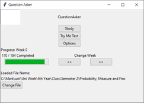

# QuestionAsker

This is a personal project that I made over the summer of 2020 to aid my mathematics studies. The Question Asker program is a Python flashcard GUI implemented using Tkinter. The user must create an Excel spreadsheet like that found within the repository, the first column with the question and the second with the answer (Latex can be typed inside $$ characters as normal). The program will count the number of times a question is asked and answered correctly, these values will be saved in the following two columns. 

NOTE: The spreadsheet cannot be opened at the same time as the GUI is in use, otherwise saving of the spreadsheet will not be possible. 

