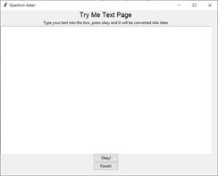

# QuestionAsker

This is a personal project that I made over the summer of 2020 to aid my mathematics studies. The Question Asker program is a Python flashcard GUI implemented using Tkinter. The user must create an Excel spreadsheet like that found within the repository, the first column with the question and the second with the answer (Latex can be typed inside `$$` characters as normal). The program will count the number of times a question is asked and answered correctly, these values will be saved in the following two columns. 

NOTE: The spreadsheet cannot be opened at the same time as the GUI is in use, otherwise saving of the spreadsheet will not be possible. 

---

# Instructions for Use

Firstly, ensure that `os.chdir(...)` on line x points to the correct directory (that which contains the spreadsheet). Then ensure that loadfilename correctly contains the name of the spreadsheet (Week 2 Summary.xlsx) by default. When the program is first run, you will see the main menu.

By pressing the 'Study' button you will progress to the second page where you can select sheets from the spreadsheet to work on, you can select as many as desired. 

After pressing 'Go!', you will be presented with a question in blue and a space to type an answer.

The 'Okay!' button will take you to the answer page, where the correct answer is displayed (with Latex formatting) and your answer is displayed below. Check buttons are available to select if your response was correct, this information will also be saved into the spreadsheet. The 'Next Question!' button repeats the process and 'Finish!' Takes us to a Recap screen then back to the main menu.

The main menu also includes a 'Try Me Text' button that allows you to check your latex as you create your spreadsheet during revision. This can be useful as some latex commands are not correctly displayed by matplotlib. The Try Me Text page is similar to the Question and Answer pages as shown below. 

